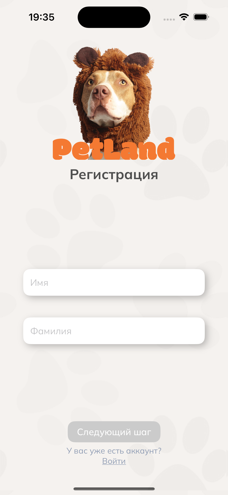

# PetLand

## Description

A marketplace for pet owners to buy and sell pets, find missing pets and other useful services. Supports iOS `16.0+` and features custom UI elements, textfield valdiation and animations.

This is the iOS version – for Backend, Web and Android versions see the [team profile](https://github.com/underbeers).

## Stack

Interface using `SwiftUI`.

Architecture – `MVVM` using `Combine`.

Networking - [`Alamofire`](https://github.com/Alamofire/Alamofire) for interacting with REST API, and [`Socket.IO–swift`](https://github.com/socketio/socket.io-client-swift) for real-time chat.

[`CachedAsyncImage`](https://github.com/lorenzofiamingo/swiftui-cached-async-image) for loading and storing images.

[`PhoneNumberKit`](https://github.com/marmelroy/PhoneNumberKit) for phone number validation.

`Keychain` for storing user session tokens.

## Screenshots

### Login and registration

### Registration

### Profile and pets

### Adverts and filtering

